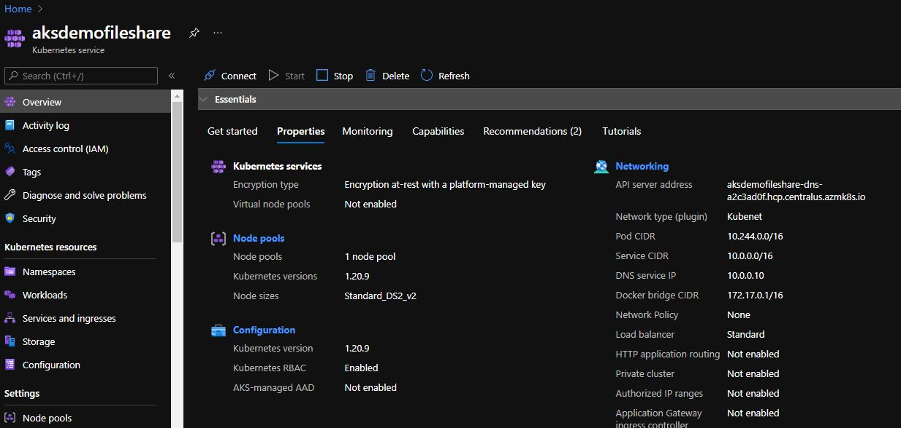
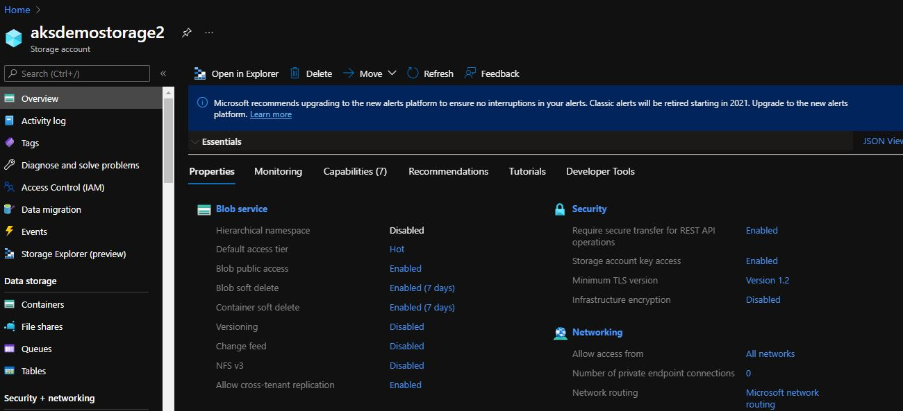
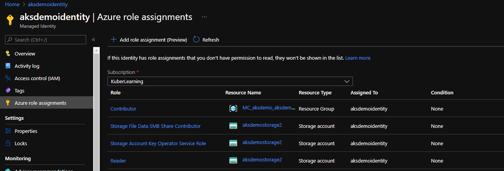
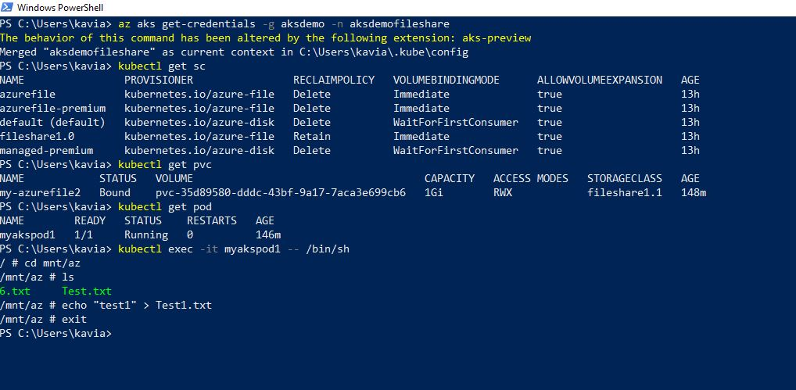

# Persistent Volume File Share - AKS POD

Steps to implement the File share mount based on AKS Managed user Identity

- Create AKS Cluster with Managed identity
- Create user managed identity
- Assign the identity with AKS Cluster
  `az aks update -g aksdemo -n aksdemofileshare --enable-managed-identity --assign-identity {identity ResourceID}`
- Create Storage Account with File Share.
- Assign RBAC Roles to UAM to access the Storage account using kubectl
  `Reader, Storage Account Key Operator Service Role, Storage File Data SMB Share Contributor`
- Apply the manifests
- Test the mount in newly created mount.

## Implementation screenshots

## Errors (Including new PV process)

### Stage 1: (First Time Goes Successfully)

PS C:\Kali\Learning\POC\Fileshare\manifest> kubectl get pods
NAME READY STATUS RESTARTS AGE
myakspod1 0/1 Pending 0 9h
myakspodcsi 0/1 ContainerCreating 0 7h24m
myapp-deploymentkey-67465fb9df-6gxpt 1/1 Running 0 5s
myapp-deploymentkey-67465fb9df-gxz6w 1/1 Running 0 95s
myapp-deploymentkey-67465fb9df-h6vn8 1/1 Running 0 5s
PS C:\Kali\Learning\POC\Fileshare\manifest> kubectl exec -it myapp-deploymentkey-67465fb9df-gxz6w -- /bin/sh
/ # cd mnt/az
/mnt/az # ls
1.txt
/mnt/az # echo "2" > 2.txt
/mnt/az # ls
1.txt 2.txt
/mnt/az # exit
PS C:\Kali\Learning\POC\Fileshare\manifest> kubectl exec -it myapp-deploymentkey-67465fb9df-h6vn8 -- /bin/sh
/ # ls
bin dev etc home lib media mnt proc root run sbin srv sys tmp usr var
/ # cd mnt/data
/bin/sh: cd: can't cd to mnt/data: No such file or directory
/ # cd mnt/az
/mnt/az # ls
1.txt 2.txt
/mnt/az # exit
PS C:\Kali\Learning\POC\Fileshare\manifest>

### Stage 2: (First key Rotation)

Check the existing mount pod:
PS C:\Kali\Learning\POC\Fileshare\manifest> kubectl exec -it myapp-deploymentkey-67465fb9df-h6vn8 -- /bin/sh
/ # ls
bin dev etc home lib media mnt proc root run sbin srv sys tmp usr var
/ # cd mnt
/mnt # cd az
/mnt/az # ls
/mnt/az #

##### Create new deployment (with reference of existing PVC)

default 13s Warning FailedMount pod/myapp-deploymentkey1-67465fb9df-9xcrz MountVolume.SetUp failed for volume "pvc-c1316e2e-11e6-427e-a0d2-d192c35bd6e7" : mount failed: exit status 32
Mounting command: mount
Mounting arguments: -t cifs -o file_mode=0777,dir_mode=0777,vers=3.0,actimeo=30,mfsymlinks,<masked> //aksdemokali.file.core.windows.net/sample1 /var/lib/kubelet/pods/53aa3886-2a89-4c9a-8f0b-0c6a5fb1fb08/volumes/kubernetes.io~azure-file/pvc-c1316e2e-11e6-427e-a0d2-d192c35bd6e7
Output: mount error(13): Permission denied
Refer to the mount.cifs(8) manual page (e.g. man mount.cifs)
default 13s Warning FailedMount pod/myapp-deploymentkey1-67465fb9df-jwmcc MountVolume.SetUp failed for volume "pvc-c1316e2e-11e6-427e-a0d2-d192c35bd6e7" : mount failed: exit status 32
Mounting command: mount
Mounting arguments: -t cifs -o file_mode=0777,dir_mode=0777,vers=3.0,actimeo=30,mfsymlinks,<masked> //aksdemokali.file.core.windows.net/sample1 /var/lib/kubelet/pods/858b2f9e-06b1-4000-85c3-104b981e537d/volumes/kubernetes.io~azure-file/pvc-c1316e2e-11e6-427e-a0d2-d192c35bd6e7
Output: mount error(13): Permission denied
Refer to the mount.cifs(8) manual page (e.g. man mount.cifs)

##### Create new PVC (with a reference of storage class)

New PVC created -> default 31s Normal ProvisioningSucceeded persistentvolumeclaim/my-pvckey1 Successfully provisioned volume pvc-714a2112-fc31-44b5-8a26-7c80ec323d23 using kubernetes.io/azure-file

Error While creating with new deployment with a reference of new PVC
default 2s Warning FailedMount pod/myapp-deploymentkey1-86c6f69b4b-rd9rr MountVolume.SetUp failed for volume "pvc-714a2112-fc31-44b5-8a26-7c80ec323d23" : mount failed: exit status 32
Mounting command: mount
Mounting arguments: -t cifs -o file_mode=0777,dir_mode=0777,vers=3.0,actimeo=30,mfsymlinks,<masked> //aksdemokali.file.core.windows.net/sample1 /var/lib/kubelet/pods/70764fb4-07ed-4697-8305-b80dddcf7023/volumes/kubernetes.io~azure-file/pvc-714a2112-fc31-44b5-8a26-7c80ec323d23
Output: mount error(13): Permission denied
Refer to the mount.cifs(8) manual page (e.g. man mount.cifs)
default 10s Normal SuccessfulCreate replicaset/myapp-deploymentkey1-86c6f69b4b Created pod: myapp-deploymentkey1-86c6f69b4b-rd9rr
default 10s Normal ScalingReplicaSet deployment/myapp-deploymentkey1 Scaled up replica set myapp-deploymentkey1-86c6f69b4b t

##### Creating new PV process

- Created PV & PVC
- Error of Deployment based on new PVC
default 7s Warning FailedMount pod/myapp-deploymentkey2-69cc4ff897-fl7md Unable to attach or mount volumes: unmounted volumes=[volume], unattached volumes=[volume kube-api-access-ws2h5]: timed out waiting for the condition
default 3s Warning FailedMount pod/myapp-deploymentkey2-69cc4ff897-llxfq MountVolume.SetUp failed for volume "pvc-80503e42-1821-499f-908b-91747f6a7213" : mount failed: exit status 32
Mounting command: mount
Mounting arguments: -t cifs -o file_mode=0777,dir_mode=0777,vers=3.0,actimeo=30,mfsymlinks,<masked> //aksdemokali.file.core.windows.net/sample1 /var/lib/kubelet/pods/9d024cd3-f744-425d-822f-278fc18ef209/volumes/kubernetes.io~azure-file/pvc-80503e42-1821-499f-908b-91747f6a7213
Output: mount error(13): Permission denied
Refer to the mount.cifs(8) manual page (e.g. man mount.cifs)
